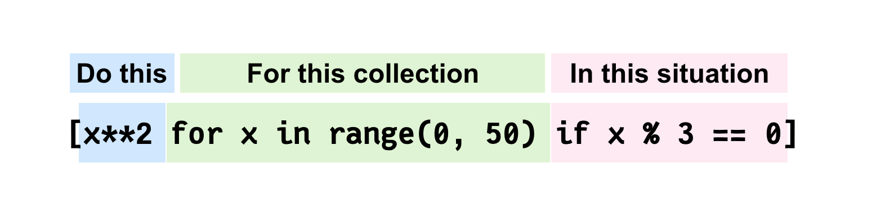

---
{
  title: 'Beginner Python List Comprehensions',
  description: 'Learn how Python comprehensions can help with applying logic to data structures without nesting for loops.',
  published: '2021-11-13T05:12:03.284Z',
  tags: ['python', 'beginner'],
}
---



# Python comprehensions

The purpose of this article is to follow up on my previous article, _[Understanding map, filter, and zip in Python](https://dev.to/codespent/understanding-map-filter-and-zip-in-python-3ifn)_, and show you a more concise way of similar functionality.

## List Comprehensions

In the previous article, I covered `map` and `filter`, so now I can show you how we can emulate the same functionality with **list comprehensions**.

```python
numbers = [1,2,3,4,5]

def square(number):
    return number*number
```

#### Using a loop to square

```python
...
squared_numbers = []
for number in numbers:
    squared = square(number)
    squared_numbers.append(squared
```

#### Using map()

```python
...
squared_numbers = map(square, numbers)
```

#### Using a list comprehension

```python
squared_numbers = [x*x  for x in numbers]
```

Note: I use `x*x` here for readability, however, you can more appropriately use the **_power of_** operator `**` for this. `[x**2]`.

Lets now re-use our **even or odd** filter example from the last article to show how comprehensions can use a condition as well. We'll get the squared number of **ONLY** even numbers in our list.

#### Using filter() and map()

```python
...
def even(number):
    if (number % 2) == 0:
        return True
    return False

even_numbers = filter(even, numbers)
even_numbers_squared = map(square, even_numbers)
```

#### Using comprehensions

```python
...
even_numbers_squared = [x**2 for x in numbers if (x % 2) == 0]
```

## Conclusion

So with this you should have a basic grasp on how comprehensions work, how they're structured, and how they can help you write more concise code!
